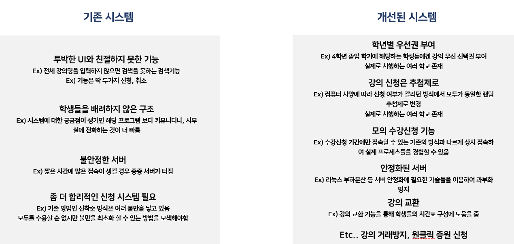
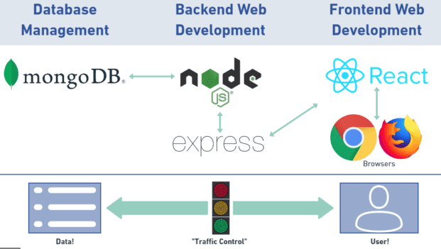
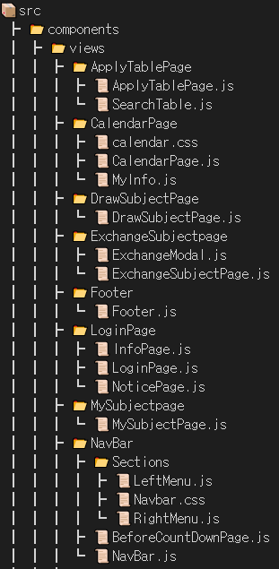
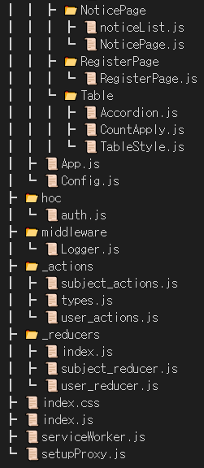
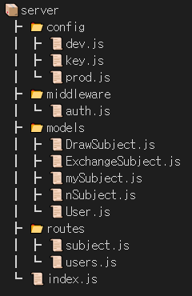

# 개선된 수강신청 시스템

## 배경 / 필요성

- 수강 신청에 필요한 수업계획 정보의 다양하고 정확한 자료를 실시간 정보제공
- 프로세스 분산처리의 일환으로 예비 수강 신청시스템의 도입으로 사용자 편의성 증대 및 과목별 수요현황을 파악함으로 유동적인 수업운영 기대
- 대학 대내외 환경변화와 교육의 패러다임 변화의 일환으로 학생 수강 신청시스템 개선으로 학생들의 웹 접근성 향상 및 양질의 수업계획 서비스의 질적 향상 도모
- 현재의 C/S, 웹 형태의 분리된 환경개선으로 사용자 편의성 제고 및 안정적인 서비스 지원
- 학생들의 기대수준 향상에 따른 서비스의 획기적 변화 필요

## 목적

- 웹 애플리케이션 보안 취약성을 진단하고 보강하여 수강신청 및 개인정보 등 보안 향상
- 콘텐츠의 신뢰성 보장 및 연계된 시스템의 안정성 확보
- 환경변화에 따른 업무 프로세스 변경 시 효율적인 시스템 변경이 가능한 프로그램 재사용성 확보
- 사용자 급증 등 새로운 환경에 대비한 확장성 보장
- 강의 취소 시 랜덤으로 수강인원이 변경되게 하여 불필요한 강의 교환 방지

## 기존 시스템과의 차이점 및 차별화 전략



## Quick Start

### 1. dependencies 파일 설치

```bash
    cd ./client
    npm install
    cd ../
    cd ./server
    npm install
    cd ../
```

### 2. Mongo DB 연동

- server/config 폴더에 dev.js 파일 생성

```javascript
module.exports = {
  mongoURI:
    "mongodb+srv://ID:PW@sugang.5uwac.mongodb.net/database?retryWrites=true&w=majority",
};
```

### 3. start !

```bash
    npm run dev
```

## Tech Stack

### Front-end


 


### Back-end


### Server


### ETC


## Architecture



## Structure

### client




### server



## Demo

### 메인페이지

- 첫화면을 로그인 페이지로 변경하고 로그인을 진행 후 랜딩페이지로 들어가게끔 수정
- Nav 컴포넌트를 좌측에도 배치에 원하는 탭으로 용이하게 이동할 수 있게 수정

1.png>)
2.png>)

### 강의 신청, 삭제, 조회 기능

- 강의 신청, 삭제, 조회 등 기본적인 수강신청에 필요한 기능

1.png>)
2.png>)
3.png>)

### 강의 교환

1.png>)
2.png>)

### 시간표

4.png>)
