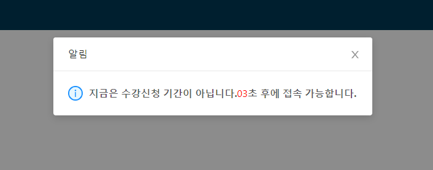
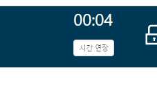
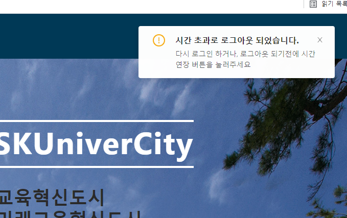

# 차이점 및 차별화 전략

# 21.04.01 진행 사항

- 첫화면을 로그인 페이지로 변경하고 로그인을 진행 후 랜딩페이지로 들어가게끔 수정
- Nav 컴포넌트를 좌측에도 배치에 원하는 탭으로 용이하게 이동할 수 있게 수정

1.png>)
2.png>)

- 수강신청 일정란의 4가지 메뉴의 경우 실제 구현할지는 미지수임 시간적 여유가 생긴다면 구현할 예정

- 추가할 기능 분반교환, 랜덤 신청, 원클릭 증원 신청 등등...

# 21.04.27 진행 사항

- 강의 신청, 삭제, 조회 등 기본적인 수강신청에 필요한 기능 구현

1.png>)
2.png>)
3.png>)

- 강의 시간표 기능 구현도 하였지만 요일 별이아닌 시간대 별 시간표가 더 보기 편리할것으로 생각되어 바꿀 예정임

- 시간표 위에 본인의 정보를 테이블 형식으로 표시할 예정임

4.png>)

- 강의 교환기능 구현 예정

# 21.05.18 진행 사항

1.png>)
2.png>)

- 강의 추첨기능, 모의 수강신청기능 구현 예정

# 21.05.31 진행 사항

- 강의 추첨기능, 4학년 우선 신청 기능 구현 예정
